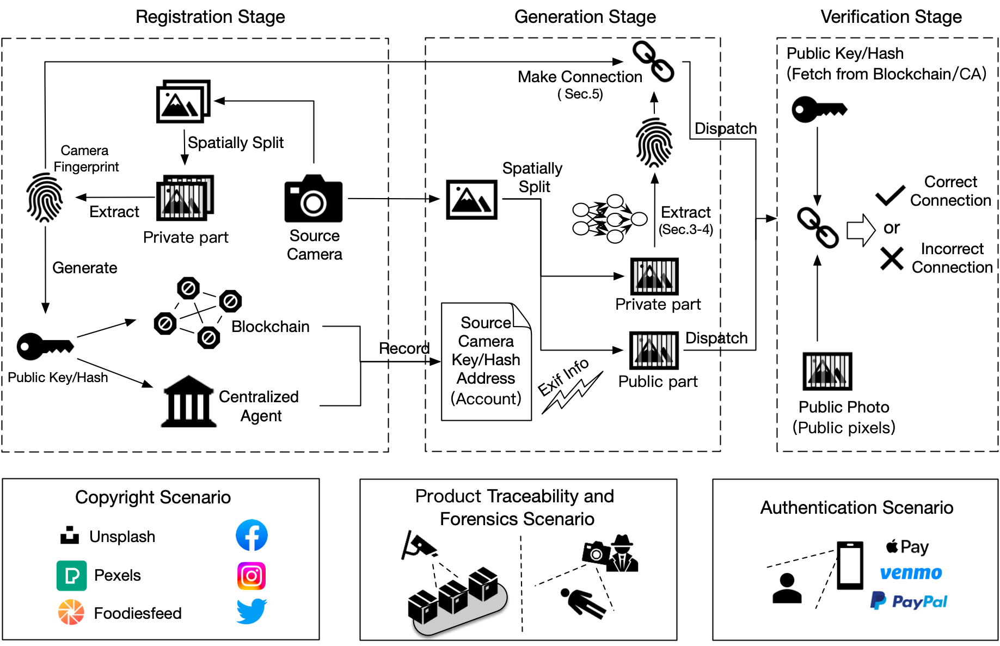
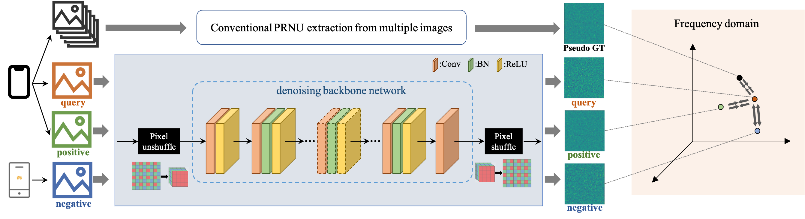

# Web Photo Source Identification based on Neural Enhanced Camera Fingerprint [WWW2023]

## Updates!!
- 【2023-02-09】: The paper was accepted by WWW 2023! The details of our paper are indicated in [arXiv version](https://arxiv.org/abs/2302.09228). We release the benchmark test set, network training codes and cryptographic codes. We integrate the 'supplementary experimental results' to the final paper (Appendix A & B) which will appear in *Proceedings* of WWW'23. 
- 【2022-12-22】: We supplement the experimental results for evaluating the security of spatial splitting. We also supplement the results of our released model on a supplementary test dataset (1,276 RAW photos from 15 Android smartphone cameras) and a public JPEG-based dataset (34,427 JPEG photos from 35 devices), both with good performance. 

## Introduction
Source camera identification of web photos aims to establish a reliable linkage from the captured images to their source cameras, and has a broad range of applications, such as image copyright protection, user authentication, investigated evidence verification, etc. 
Our paper presents an innovative and practical source identification framework that employs neural-network enhanced sensor pattern noise to trace back web photos efficiently while ensuring security. 
The codes for fingerprint extraction network and benchmark dataset with modern smartphone cameras photos are all publicly available in this repo.



## Preparations
* Download the fingerprint extraction network model file and put them under directory `models/ckpts/`.
* Download the iPhone/Android RAW photos (about 17G/44G) and put them in `data/images/`. We provide download issues with DOIs as indicated in paper. 
* Install python requirements in `requirements.txt`.

## Run and Evaluation
Run fingerprint extraction network and save fingerprints in `results/fingerprints`:
```bash
python3 run_extract.py
```

Then run evaluation scripts on above fingerprint file as:
```bash
python3 run_ncc.py
```
You should see the output performance. In the case of single photo registration, the result with iPhone images is
```
- Results locates at：/path/PhotoNecf/results/measures/fingerprints_vs_fingerprints.npy, AUC: 99.80265567168468EER: 1.6559416559416558
```

## Train
Run the training script with default hyperparameters. Before that, the users are required to provide: (1) the pseudo GT (located at line 16 of utils/datasetnp.py ) by the conventional PRNU algorithm as described in Section 2.1 of paper; (2) the training data set and test data set with npy format (located at line 20 & 28 of run_train.py).
```bash
python3 run_train.py
```


## Cryptographic Schemes
We provide the codes of zero-knowledge proof scheme in `cyptographc_schemes` folder with its own README description.

## Cite Our Paper
If the code is helpful for your work, please cite our paper
```
@inproceedings{qian2023web,
  title={Web Photo Source Identification based on Neural Enhanced Camera Fingerprint},
  author={Qian, Feng and He, Sifeng and Huang, Honghaoo and others},
  booktitle={Proceedings of the ACM Web Conference 2023},
  year={2023}
}
```

## License
The code is released under MIT license

```bash
MIT License

Copyright (c) 2023 Ant Grooup

Permission is hereby granted, free of charge, to any person obtaining a copy
of this software and associated documentation files (the "Software"), to deal
in the Software without restriction, including without limitation the rights
to use, copy, modify, merge, publish, distribute, sublicense, and/or sell
copies of the Software, and to permit persons to whom the Software is
furnished to do so, subject to the following conditions:

The above copyright notice and this permission notice shall be included in all
copies or substantial portions of the Software.

THE SOFTWARE IS PROVIDED "AS IS", WITHOUT WARRANTY OF ANY KIND, EXPRESS OR
IMPLIED, INCLUDING BUT NOT LIMITED TO THE WARRANTIES OF MERCHANTABILITY,
FITNESS FOR A PARTICULAR PURPOSE AND NONINFRINGEMENT. IN NO EVENT SHALL THE
AUTHORS OR COPYRIGHT HOLDERS BE LIABLE FOR ANY CLAIM, DAMAGES OR OTHER
LIABILITY, WHETHER IN AN ACTION OF CONTRACT, TORT OR OTHERWISE, ARISING FROM,
OUT OF OR IN CONNECTION WITH THE SOFTWARE OR THE USE OR OTHER DEALINGS IN THE
SOFTWARE.
```
